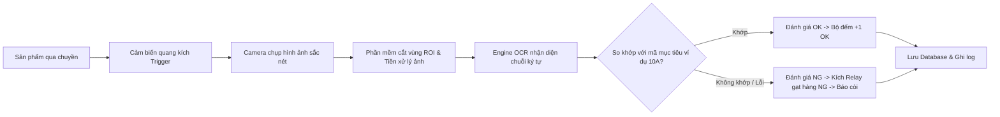

# KẾ HOẠCH DỰ ÁN: HỆ THỐNG CAMERA KIỂM TRA MÃ KÝ TỰ SẢN PHẨM TRÊN BĂNG CHUYỀN (CONVEYOR OCR INSPECTION)

---

## 1. TỔNG QUAN DỰ ÁN

### 1.1. Mục tiêu
Xây dựng hệ thống thị giác máy tính (Machine Vision / OCR) tự động nhận diện ký tự in/khắc trên sản phẩm khi di chuyển qua băng chuyền:
* **Đầu vào ca sản xuất:** Người vận hành chọn/nhập mã tiêu chuẩn cần chạy (Ví dụ: `10A`).
* **Kiểm tra thời gian thực:** Mỗi khi sản phẩm đi qua cảm biến, camera chụp hình ảnh -> giải thuật OCR đọc ký tự.
* **Đánh giá:**
  * Ký tự đọc được trùng khớp mã chỉ định (`10A`) $\rightarrow$ Đánh giá **PASS (OK)**.
  * Ký tự sai mã (ví dụ: `5A`), mờ, mất nét hoặc không đọc được $\rightarrow$ Đánh giá **FAIL (NG)**.
* **Hành động ngoại vi:**
  * Xuất tín hiệu kích hoạt cơ cấu phân loại (xy lanh gạt/đẩy sản phẩm NG sang làn riêng).
  * Kích hoạt còi/đèn tháp cảnh báo (Andon light).
  * Lưu trữ hình ảnh và lịch sử để truy vết chất lượng.

---

## 2. KIẾN TRÚC HỆ THỐNG

### 2.1. Sơ đồ luồng hoạt động (Workflow)

---

## 3. THIẾT KẾ PHẦN CỨNG & HẠ TẦNG (HARDWARE)

| STT | Thành phần | Yêu cầu kỹ thuật & Gợi ý thiết bị | Vai trò |
| :--- | :--- | :--- | :--- |
| **1** | **Camera công nghiệp** | Camera USB 3.0 hoặc GigE (Hikrobot / Basler / Daheng), Global Shutter (chống nhòe chuyển động khi hàng chạy), tốc độ khung hình $\ge 30-60$ FPS. (Giai đoạn thử nghiệm PoC có thể dùng Webcam chất lượng cao). | Chụp ảnh sắc nét sản phẩm khi chuyển động |
| **2** | **Ống kính (Lens)** | C-mount, tiêu cự 8mm/12mm/16mm tùy thuộc vào khoảng cách làm việc (Working Distance) và trường nhìn (Field of View). | Căn chỉnh góc nhìn và độ phóng đại |
| **3** | **Chiếu sáng (Lighting)** | Đèn LED chuyên dụng thị giác máy: Đèn vòng (Ring light), đèn thanh (Bar light) hoặc vòm (Dome light) màu trắng/đỏ. | Đảm bảo ký tự tương phản cao với nền, loại bỏ bóng mờ/lóa sáng |
| **4** | **Cảm biến kích chụp (Trigger)** | Cảm biến quang phản xạ khuếch tán hoặc thu phát chung (Omron/Autonics), phản hồi nhanh (< 1ms). | Bắt đúng khoảnh khắc sản phẩm đi vào tầm ngắm camera |
| **5** | **Module I/O điều khiển** | Mạch USB Relay / Arduino / Modbus TCP / PLC (Mitsubishi, Siemens) để kích xy lanh loại hàng. | Đẩy sản phẩm NG ra khỏi băng chuyền |
| **6** | **Máy tính xử lý (IPC/PC)** | Máy tính công nghiệp hoặc Mini PC (Core i5+, RAM 16GB, có card đồ họa NVIDIA nếu cần chạy Deep Learning tốc độ cao). | Chạy phần mềm xử lý ảnh và giao diện HMI |

---

## 4. GIẢI PHÁP PHẦN MỀM & CÔNG NGHỆ (SOFTWARE STACK)

### 4.1. Ngôn ngữ & Công nghệ
* **Ngôn ngữ lập trình chính:** Python 3.10+ (Phù hợp triển khai nhanh, hệ sinh thái Computer Vision phong phú) hoặc C# .NET WPF (Giao diện công nghiệp mượt mà).
* **Thư viện xử lý ảnh:** OpenCV (`cv2`), NumPy, Albumentations.
* **OCR Engine (Lựa chọn tối ưu):**
  * **PaddleOCR (Khuyên dùng số 1):** Tốc độ cực nhanh (30-80ms/ảnh trên CPU), độ chính xác rất cao với font chữ in công nghiệp, chữ in kim, laser.
  * **EasyOCR / Tesseract:** Dự phòng hoặc bổ trợ.
  * **YOLOv8/v11 Character Detection:** Huấn luyện riêng nếu ký tự in đặc thù hoặc phông chữ quá biến dạng.
* **Giao diện người dùng (HMI):** PyQt6 / PySide6 (giao diện máy công nghiệp chuyên nghiệp, hỗ trợ dark mode, hiển thị camera 60FPS).
* **Cơ sở dữ liệu & Báo cáo:** SQLite / PostgreSQL lưu trữ lịch sử kiểm tra, tỷ lệ OK/NG, hình ảnh lỗi theo ngày/ca.

### 4.2. Xử lý thuật toán (Pipeline)
1. **Trigger Event:** Nhận tín hiệu kích chụp từ cảm biến qua cổng COM/I/O.
2. **Crop ROI (Region of Interest):** Cắt đúng vùng chứa mã ký tự để tối ưu tốc độ và giảm nhiễu nền.
3. **Tiền xử lý (Image Preprocessing):**
   * Grayscale $\rightarrow$ Cân bằng sáng (CLAHE).
   * Lọc nhiễu Gaussian / Bilateral Filter.
   * Ngưỡng hóa nhị phân thích nghi (Adaptive Thresholding) hoặc Otsu.
4. **Nhận diện ký tự (OCR Inference):** Trả về chuỗi ký tự nhận dạng + Tỉ lệ tin cậy (Confidence Score).
5. **Bộ so khớp thông minh (Matching Logic):**
   * Chuẩn hóa chuỗi (loại bỏ khoảng trắng, ký tự đặc biệt, uppercase).
   * So khớp chính xác (`recognized == target`).
   * Xử lý các cặp ký tự dễ nhầm lẫn trong môi trường công nghiệp (ví dụ: `0` và `O`, `1` và `I`, `8` và `B`) bằng bảng ánh xạ thông minh (Confusion Matrix Mapping).

---

## 5. CÁC TÍNH NĂNG CHÍNH CỦA PHẦN MỀM (HMI)

1. **Bảng điều khiển ca sản xuất (Production Setup):**
   * Cho phép chọn mã sản phẩm (Recipe) từ danh sách hoặc quét mã vạch master barcode.
   * Nhập mã mục tiêu (ví dụ: `10A`, `20B`, `BATCH-99`).
2. **Khung nhìn Camera thời gian thực (Live View & Overlay):**
   * Hiển thị khung định vị (ROI box).
   * Đổi màu viền: **Xanh lá cây** khi nhận diện đúng `10A` (OK), **Đỏ rực** khi sai mã `5A` hoặc không thấy ký tự (NG).
3. **Thống kê sản lượng thời gian thực (Counters):**
   * Tổng sản lượng (Total Passed).
   * Số lượng OK / Số lượng NG.
   * Tỷ lệ lỗi PPM / Tỷ lệ Yield (%).
4. **Cài đặt & Hiệu chỉnh (Configuration Screen):**
   * Điều chỉnh độ sáng, độ phơi sáng (Exposure), Gain của camera.
   * Cấu hình ngưỡng tin cậy (Threshold Confidence $\ge 0.85$).
   * Cấu hình cổng COM kết nối Relay / PLC đẩy hàng.
   * Tùy chọn lưu ảnh: Chỉ lưu ảnh NG (để tiết kiệm ổ cứng) hoặc lưu toàn bộ.
5. **Truy vết & Báo cáo (Audit Log & Reports):**
   * Xem lại danh sách ảnh NG gần nhất.
   * Xuất báo cáo ca chạy ra file Excel/CSV.

---

## 6. LỘ TRÌNH TRIỂN KHAI THEO TỪNG GIAI ĐOẠN (ROADMAP)

### Giai đoạn 1: Chuẩn bị & Thu thập mẫu (1 - 2 ngày)
* Thu thập 30 - 50 mẫu sản phẩm thực tế (cả mẫu in chuẩn `10A`, mẫu in lỗi, mẫu nhòe/lệch).
* Khảo sát tốc độ băng chuyền (m/phút) để tính toán thời gian phản hồi cần thiết ($< 200\text{ms}$).

### Giai đoạn 2: Phát triển thuật toán lõi (Core OCR Engine) (2 - 3 ngày)
* Thiết lập môi trường Python + OpenCV + PaddleOCR.
* Viết kịch bản tiền xử lý ảnh và trích xuất chữ.
* Viết logic so sánh chuỗi và đánh giá OK/NG.
* Thử nghiệm trên tập ảnh mẫu, tinh chỉnh độ chính xác đạt $> 99\%$.

### Giai đoạn 3: Xây dựng giao diện ứng dụng (HMI GUI) (2 - 3 ngày)
* Thiết kế giao diện trực quan bằng PyQt6: Màn hình lớn, nút bấm to cho người vận hành thao tác bằng màn hình cảm ứng hoặc chuột.
* Tích hợp Live Camera feed đa luồng (Multi-threading) để giao diện không bị giật lag khi đang nhận diện.

### Giai đoạn 4: Tích hợp thiết bị ngoại vi & I/O (1 - 2 ngày)
* Kết nối module Relay qua cổng COM (Serial) hoặc chân GPIO/Modbus.
* Viết module phát tín hiệu kích xy lanh gạt khi phát hiện NG.
* Xử lý độ trễ trễ kích (Delay trigger theo khoảng cách từ camera đến cơ cấu gạt).

### Giai đoạn 5: Thử nghiệm thực tế tại xưởng & Bàn giao (2 - 3 ngày)
* Lắp đặt cố định camera, đèn và cảm biến lên khung băng chuyền.
* Chạy thử với tốc độ sản xuất thật.
* Tinh chỉnh ánh sáng theo điều kiện môi trường nhà xưởng.
* Đào tạo người vận hành và bàn giao tài liệu kỹ thuật.

---

## 7. CÁC RỦI RO THƯỜNG GẶP & GIẢI PHÁP KHẮC PHỤC

| Rủi ro kỹ thuật | Nguyên nhân | Giải pháp xử lý |
| :--- | :--- | :--- |
| **Ảnh bị nhòe (Motion Blur)** | Tốc độ băng chuyền nhanh, màn trập camera mở quá lâu (Rolling shutter). | Dùng camera Global Shutter, giảm Exposure Time ($< 1000\mu s$) và tăng cường độ đèn chiếu sáng. |
| **Chữ bị bóng/lóa (Reflection)** | Bề mặt sản phẩm bóng (nhựa bóng, kim loại, bao bì nilon). | Dùng đèn vòm (Dome Light) hoặc kính phân cực (Polarizer Filter) gắn trước ống kính. |
| **Nhầm lẫn ký tự (ví dụ O và 0)** | Font chữ in quá giống nhau. | Áp dụng logic bổ trợ độ dài ký tự hoặc cấu hình Regex mẫu (`[0-9]{2}[A-Z]`). |
| **Chậm nhịp khi chuyền chạy nhanh** | OCR chạy tốn thời gian. | Tối ưu bằng PaddleOCR bản Mobile/Lightweight hoặc tăng tốc với TensorRT / OpenVINO. |

---

## 8. ĐỀ XUẤT BƯỚC TIẾP THEO

1. **Xác nhận môi trường thử nghiệm:** Bạn đang có sẵn camera loại nào (Webcam, USB Industrial Camera, hay IP RTSP)?
2. **Khởi tạo mã nguồn:** Chúng ta có thể tạo ngay khung mã nguồn (Project Template) bằng Python gồm:
   * Module kết nối Camera.
   * Module OCR nhận diện mã.
   * Giao diện UI thử nghiệm nhập mã đích (`10A`) và kiểm tra ảnh trực tiếp.
